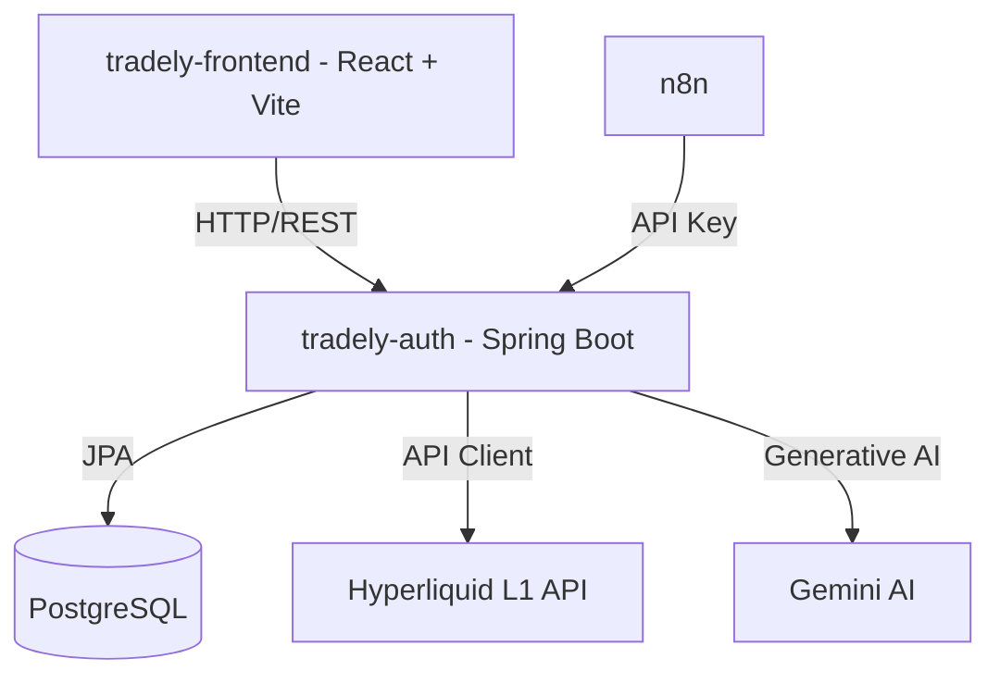

# Tradely

```txt
@@@@@@@@@@@@@@@@@@@@@@@@@@@@@@@@@@@@@@@@@@@@@@@@@   tradely
@@@@@@@@@@@@@@@@@@@@@@@@@@@@@@@@@@@@@@@@@@@@@@@@@   --------------------------
@@@@@@@#-.                            .:+@@@@@@@@   Plataforma de analisis tecnico
@@@@@*                                    -@@@@@@   para Hyperliquid L1 DEX
@@@@@                                      -@@@@@
@@@@#        .-====.                       :@@@@@   Frontend  : React · TS · Vite
@@@@#       @@@@@@@:                       :@@@@@   Backend   : Spring Boot · Java
@@@@#        .@@@@@:                       :@@@@@   Seguridad : JWT · AES-256-GCM
@@@@#           :@@:        @@@@@@@@       :@@@@@   Datos     : PostgreSQL
@@@@#             ..        @@@@@@@@       :@@@@@   Automatiz : n8n
@@@@#      .                @@@@@@@@       :@@@@@
@@@@#     .@@@:             @@@@@@@@       :@@@@@   Funciones
@@@@#     .@@@@@#.          @@@@@@@@       :@@@@@   - Monitoreo de portafolio
@@@@#     .@@@@@@@@.        @@@@@@@@       :@@@@@   - Alertas de trading
@@@@#     .@@@@@@@@:        @@@@@@@@       :@@@@@   - Analisis de riesgo con IA
@@@@#     .@@@@@@@@:        @@@@@@@@       :@@@@@
@@@@#      @@@@@@@@:        @@@@@@@+       :@@@@@
@@@@#       #@@@@@@:        @@@@@@=        :@@@@@
@@@@#                                      :@@@@@
@@@@@.                                     =@@@@@
@@@@@@.                                  .%@@@@@@
@@@@@@@@@++++++++++++++++++++++++++++++#@@@@@@@@@
@@@@@@@@@@@@@@@@@@@@@@@@@@@@@@@@@@@@@@@@@@@@@@@@@
@@@@@@@@@@@@@@@@@@@@@@@@@@@@@@@@@@@@@@@@@@@@@@@@@


------------------------------------------------------------------------------------------------

- Arquitectura

El monorepo esta dividido en tres servicios y una base de datos compartida:

    tradely-monorepo/
    ├── tradely-frontend/    # SPA React + Vite
    ├── tradely-auth/        # API Spring Boot
    ├── n8n/                 # Automatizacion de flujos
    └── docker-compose.yml
```


```txt
------------------------------------------------------------------------------------------------

- Requisitos previos

- [Docker](https://www.docker.com/) y Docker Compose instalados
- Clave de API de [Gemini (Google AI)](https://ai.google.dev/)
- Cuenta en [Hyperliquid](https://hyperliquid.xyz/) (para operar en el DEX)

---

- Configuracion del entorno

Crea un archivo '.env' en la raiz del monorepo. Puedes copiar el archivo de ejemplo incluido:
```
```bash
cp .env.example .env
```
```txt
Rellena las siguientes variables:
```
```txt
env
# Base de datos
DB_USER=tu_usuario_postgres
DB_PASSWORD=tu_contrasena_segura
DB_NAME=tradely_db

# Gemini AI
GEMINI_KEY=tu_gemini_api_key

# JWT
JWT_SECRET=tu_jwt_secret_muy_largo_y_seguro
JWT_EXPIRATION=86400000

# Comunicacion interna con n8n
AGENT_API_KEY=tu_clave_secreta_para_n8n

# Cifrado de wallets (AES-256-GCM)
WALLET_ENCRYPTION_PASSWORD=contrasena_fuerte
WALLET_ENCRYPTION_SALT=valor_hexadecimal_16_chars

# SMTP (Gmail App Password)
SMTP_EMAIL=tu_correo@gmail.com
SMTP_PASSWORD=tu_contrasena_de_aplicacion

------------------------------------------------------------------------------------------------

- Ejecucion con Docker 
```
```bash
# Construir e iniciar todos los servicios
docker compose up --build -d

# Ver logs en tiempo real
docker compose logs -f

# Detener el stack
docker compose down
```
```txt
Una vez arriba, los servicios estaran disponibles en:

| Servicio   | URL                     |
|------------|-------------------------|
| Frontend   | http://localhost:3000   |
| Backend    | http://localhost:8081   |
| n8n        | http://localhost:5678   |
| PostgreSQL | localhost:5432          |

------------------------------------------------------------------------------------------------

- Ejecucion local (sin Docker)

    1. Base de datos

Crea una base de datos PostgreSQL llamada `tradely_db` e introduce las credenciales en las variables 
de entorno o en el archivo de propiedades del backend.

    2. Backend (Spring Boot)
```
```bash
cd tradely-auth
./mvnw spring-boot:run
# Disponible en: http://localhost:8081
```
```txt
------------------------------------------------------------------------------------------------

    3. Frontend (React + Vite)
```
```bash
cd tradely-frontend
npm install
npm run dev
# Disponible en: http://localhost:5173
```
```txt
------------------------------------------------------------------------------------------------

- Stack tecnologico

Frontend
- React 19 · TypeScript · Vite 8
- Tailwind CSS v4 · Recharts
- TanStack React Query v5 · Axios

Backend
- Spring Boot 3 · Java 17
- Spring Security · JWT
- AES-256-GCM (Java Cryptography Architecture)
- PostgreSQL · Spring WebFlux (WebClient)

DevOps y automatizacion
- Docker · Docker Compose
- n8n · PostgreSQL 15-alpine

------------------------------------------------------------------------------------------------

- Seguridad

    - Las contraseñas de usuario se almacenan con hashing seguro en PostgreSQL.
    - Los datos sensibles de wallets de Hyperliquid se cifran con AES-256-GCM, usando contraseña 
    y salt definidos en variables de entorno.
    - Todos los endpoints estan protegidos mediante JWT generados en el inicio de sesion.

------------------------------------------------------------------------------------------------
```